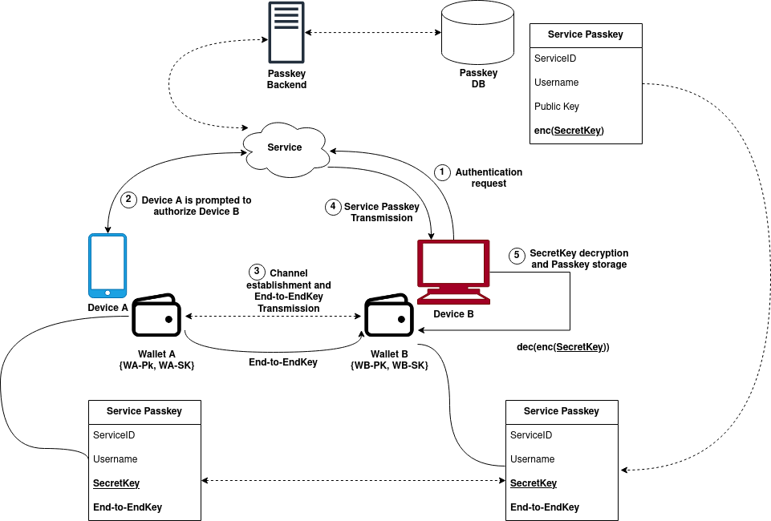
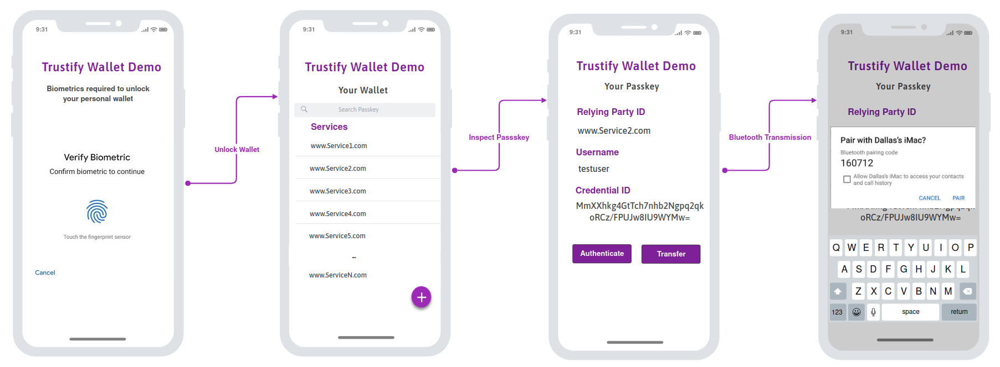

# Project Report

- **Team Leader:** Davide Caria
- Arianna Abis
- Simone Levetto
- Lin Tian
- Francesco Zaritto

March 2023 - June 2023

## 1. Introduction

This report marks the culmination of a six-month endeavor by our student team, tasked with a challenge proposed by Aruba. The objective of this challenge, which took place in the second semester of academic year 2022/2023, was to investigate the existing landscape of passwordless solutions and their current implementations, to then propose some improvements in either the technological aspect or in the application of such technologies. Additionally, understanding the current password-based authentication model was crucial, as we aimed to delve into both the technological aspects and the business prospects of such emerging technologies. The only constraint we faced was that our research needed to be based on already-existing or soon-to-be-released standards.

This work was a collaborative effort involving students from diverse master's programs. Specifically, the team comprised two cybersecurity engineers, one software engineer, one mathematical engineer, and one automotive engineer. The diversity within the team allowed us to examine each step from multiple angles and perspectives. Each team member contributed unique knowledge, propelling us closer to our eventual solution. At regular intervals of three weeks, we presented our progress to Aruba mentors and professors from Politecnico di Torino, who provided invaluable feedback based on their extensive experience in the cybersecurity domain. Additionally, we were guided by researchers in the economic field, particularly focusing on the business-oriented aspect of this report. We are proud to have been recognized as the best team in the challenge, securing the first-place position in the competition.

In this report, we detail the journey from the initial concept to the final demonstrable prototype. This document serves as a comprehensive walkthrough, highlighting the various steps taken, analyzing the plethora of options considered, and ultimately presenting the solution we opted to pursue. 

The report is divided into two conceptually distinct parts, akin to two faces of the same coin. The first part focuses on the technical aspects, providing in-depth insights into the technology under consideration, how we harnessed existing architecture, and the motivations guiding significant decisions. This is far from being a research paper, and as engineering students, we tried to ensure this report is as comprehensive as possible. We aimed to explain key concepts wherever necessary.

The second half comprises an analysis of the sectors in which our solution could be employed, considering the minor modifications made to the base product we designed. Although we are aware of the versatility of a passwordless solution across numerous domains, we narrowed our focus to three key sectors: Automotive, Medical, and Financial. Within these sectors, we delved deeper, analyzing the necessary adjustments to align our initial solution with the current policies and standards prevalent in the financial realm.

To conclude this introduction, we emphasize that our choices were aligned with current standards and state-of-the-art protocols. However, we are aware that in the rapidly evolving field of passwordless technology, some of these standards and protocols may evolve to include the new findings in this domain.

## 2. Technical section

### 2.1. The problem of password-based authentication systems

Passwords have been the standard for authentication since the beginning of the 70s. As time passed the attackers learned how to break and steal them from the users. We kept adding more and more layers of security, enforcing long and complex passwords, implementing renewal policies, adding secret questions, and introducing multi-factor authentication. Those solutions worked as soon as they were introduced, but they are proving to be only a patch of a giant hole in authentication system security. Recent data show that passwords are one of the weakest points in the chain of authentication, and among all the actors involved, users are still the majority of the victims of cybercrimes. 

### 2.2. Current password-less authentication standard

Based on those premises the Challenge by Aruba firm focused on the use of a passwordless paradigm which represents the future of authentication systems. Specifically, instead of using a password to gain access to a resource, the user can use some other means that can prove its identity and right of access. The input of the challenge was given by a presentation of the FIDO alliance project and how their standards could be used to solve the aforementioned problem.

2.2.1. **Fido standard details**

As reported on the FIDO alliance website: The FIDO protocols use standard public key cryptography techniques to provide stronger authentication. During registration with an online service, the user’s client device creates a new key pair. It retains the private key and registers the public key with the online service. Authentication is done by the client device proving possession of the private key to the service by signing a challenge. The client’s private keys can be used only after they are unlocked locally on the device by the user. The local unlock is accomplished by a user–friendly and secure action such as swiping a finger, entering a PIN, speaking into a microphone, inserting a second–factor device, or pressing a button

2.2.2. **A simple use case**

As it is briefly described by [FIDO Alliance](https://fidoalliance.org/how-fido-works/) and reported below, the authentication process, from the key-pair creation to the actual authentication granting, is characterized by the following activities:  

1. **Registration:**
    - User is prompted to choose an available FIDO authenticator that matches the online service’s acceptance policy.
    - User unlocks the FIDO authenticator using a fingerprint reader, a
    button on a second–factor device, securely–entered PIN or other method.
    - User’s device creates a new public/private key pair unique for the local device, online service and user’s account.
    - Public key is sent to the online service and associated with the
    user’s account. The private key and any information about the local
    authentication method (such as biometric measurements or templates)
    never leave the local device.
2. **Login:**
    - Online service challenges the user to login with a previously registered device that matches the service’s acceptance policy.
    - User unlocks the FIDO authenticator using the same method as at Registration time.
    - Device uses the user’s account identifier provided by the service to select the correct key and sign the service’s challenge.
    - Client device sends the signed challenge back to the service, which verifies it with the stored public key and logs in the user.

### 2.3. Issues and limitations of the current solution

Although the FIDO standard is a widely adopted solution for passwordless authentication, its stringent architecture presents significant usability challenges. Two notable drawbacks include the lack of key recovery options in case of device loss and the requirement to store the private key within the device itself.
To illustrate these limitations, let's consider a scenario: a user has registered with a service using a FIDO wallet installed on their mobile phone. At a later time, they attempt to log in to the same service from a laptop. Unfortunately, this is not possible because the account is linked to the user's public key, which can only be paired with the private key residing in their mobile phone. Even if the laptop has the wallet installed, either as an application or a hardware component, the keys cannot be synchronized between devices. Similarly, if the user loses their mobile phone, they permanently lose access to their account.
Over the years, the FIDO standard has evolved, leading to the development of adaptations by various companies. For instance, hardware devices capable of generating tokens have been made compatible with the FIDO standard, serving as portable hardware wallets. These devices securely host the cryptographic materials and require biometric authentication to unlock. This solution proves effective in cases where the FIDO standard is implemented and users are willing to carry additional hardware.
In recent times, notable players like Google and Apple have made their way into the market, leveraging and further developing a solution called [Passkey](https://passkeys.dev/). This new offering addresses some of the limitations of the FIDO standard by natively supporting the exportability of keys. However, it is important to note that the key synchronization mechanism implemented by Apple, Google and Microsoft is restricted to devices from the same vendor. This means that cross-compatibility between devices of different vendors is not feasible. While the introduction of Passkey brings advancements in key management and exportability, the lack of interoperability among different vendor devices remains a significant hurdle that needs to be addressed for a more seamless user experience and widespread adoption.

### 2.4. Architecture proposal

The proposed architecture is a passwordless authentication design that allows the achievement of strong authentication without renouncing to the flexibility and ease of use; It is characterized mainly by the following components/functional units:

- **Passkey**: digital credential that replaces the password, it is tied to a user account and a website or application
- **Wallet**: data structure to support the passkey handling and sharing functionality
    - In addition, it allows the identification of the device, it stores both the device bounding keypair (PK,SK) and the End-to-End encryption keys (Ek)
- **Server storage**: a functional component that can be integrated in a system or standalone and supports both the synchronization and the verification of the passkeys
- **Bluetooth transmission module**: module used to transfer the End-to-End key

The fundamental components mentioned earlier served as the foundational elements in shaping our architectural proposal. Our primary focus was to craft an adaptable authentication system, allowing for Passkey recovery and seamless interoperability across diverse devices. While established players like Apple and Microsoft have made strides in implementing FIDO technology, their offerings lack the crucial aspect of cross-vendor interoperability. 

This realization pushed us to create a vendor-agnostic solution, designed to be plug-and-play for any service seeking for security beyond conventional passwords. At the core of our architecture lies the concept of the Wallet data structure, enabling the utilization, recovery, and transition of Passkeys. Functioning as a dedicated software repository for keys, the Wallet serves as the primary interface for end-users. It incorporates a PK/SK key pair, crucial for device identification if necessitated by the service the user aims to access.

**2.4.1. Wallet data structure**

From the user's standpoint, utilizing the Passkey is nearly seamless. Access to the Wallet is secured through an authentication process. When the user logs in using one of the available biometric factors, access to the Passkey repository is granted. The interface closely resembles a typical password manager, allowing users to register a new Passkey or associate the present device with a trusted one for seamless synchronization of the selected key.

The Wallet has the crucial role of securely housing the End-to-End (EtE) encryption key, established during the Passkey creation and agreed with the respective service. This key is pivotal in securely storing the Passkey within the database. During Passkey recovery, the significance of this EtE key becomes evident, as anyone with access to it can decrypt the Passkey stored on the server. Consequently, caution is necessary during the transmission of the EtE key, a topic we'll treat in the subsequent section.

### 2.5. Proof of concept of our design

In this section, we analyze the synchronization and Passkey recovery mechanisms using a detailed example that describes the entire process. During the synchronization phase, all the components are involved and the potential of the architecture is exposed. We imagined a straightforward scenario where a user needs to authenticate with a service that requires a Passkey, but the selected device hasn't been provisioned with the key for access. 

**Notation:**

- Device A (DevA) → Wallet A (WA)
- Device B (DevB) → Wallet B (WB)

The two devices have non-coherent wallet instances installed.

We consider the following assumptions:

1. DevA was previously used to generate a Passkey which is stored both inside WA and the Passkey backend of the service.
2. DevB tries to perform authentication with the same service for which a valid Passkey exists, even if stored in another device.

Steps in details:

1. The user initiates an authentication request from DevB, a device not yet synchronized with the required Passkey.
2. The service prompts DevA, the device that originally generated the Passkey, to authorize the incoming authentication request.
3. DevA and DevB engage their respective Wallet interfaces (WA, WB) to securely execute an End-to-End key exchange. An out-of-band channel, such as Bluetooth, could be utilized to verify proximity between the devices.
4. Given DevB's authorization by DevA, the transmission of the Service Passkey can take place.
5. Post EtE key transmission and Service Passkey retrieval, DevB can decrypt and securely store the key in its wallet, ensuring secure access to the service.

### 2.7. Demo

The demo consists in a simple Client-Server application that performs the creation of a Passkey and allows the user to retrieve a new one that is stored in a local server. As the time and resources were limited, the focus of the demo is to show only a possible implementation of the synchronization mechanism. The Demo as been analyzed and tested during the final presentation of the Challenge.

**2.7.1 Design mockup and breakdown**

- Client - Wallet: it is a mobile/desktop application providing (mainly) to the user the
following functionalities:
    - secure storage and access to passkeys
    - handling Wallet’s unique key-pair
    - Passkeys synchronization (Bluetooth channel and backend retrieval)
- Server - Passkey Backend: it is a server application whose functions can be extended in
order to adapt the system to the specific requests of the application domain to which it refers;
considering only the main features, those are:
    - Authentication Validation
    - Wallet Items secure storage and access:
        - passkeys' public material
        - wallet public material
    - device identification (leveraging wallet key-pair to perform asymmetric challenge-response authentication)
        
        
        
                                                               Client Application Overview
        

**2.7.2 Implementation details**

The modules that will be presented from now on describe the main functionalities needed on the client side. Those modules have to be taken as general guidelines and represent the minimum set of operations that the wallet should present. Starting from them, we are committed to delivering a proof of concept that is both satisfactory from a technical and functional point of view. However, due to limited resources, some simplifications will be adopted to carry out the job. We will provide motivations and insights for each simplification that we do, as well as ensure the validity of the PoC.

The client application implements the concept of a wallet and its related functionalities. 

Taking Android as an example, we will discuss in more detail the **modules** involved in the demo and the Android APIs together with the flutter plugins that we can leverage.

**Modules:**

1. **Local Auhtentication** 
    1. To ensure the security of the wallet and the stored passkeys, local access to the application is granted only after a successful biometric authentication check
    2. This vital functionality is achieved by utilizing specialized libraries that abstract the underlying platform's biometric authentication capabilities
2. **Wallet**
    1. Once the user has successfully completed the local authentication, he gains access to his personalized wallet, which is presented as a list of URLs. Each URL corresponds to a service or relying party ID, providing convenient access to the associated passkeys. This approach enhances user experience and ease of use
3. **Key Storage**
    1. The storage of passkeys requires addressing different strategies for managing the primary keys involved
        1. **E2E Key Storage:** 
            - To achieve synchronization of the Passkey private keys, the user needs to transmit the E2E keys to other devices so that the corresponding encrypted Passkey private keys that the user retrieves from the Passkey backend can be decrypted on those devices. Therefore, it is important to store the E2E keys in a manner that allows exportation when required. The keep the E2E keys secure at rest on the user’s devices, there are at least two features we would have to achieve:
                - **Encryption:** The E2E keys should be stored in an encrypted format. By encrypting the E2E keys, even if an unauthorized process gains access to the user's device, it won't be able to retrieve and use the actual E2E keys without the decryption key
                - **Limited accessibility:** Access to the E2E keys should be restricted to the wallet application. By limiting accessibility, we minimize the risk of other processes gaining control over the keys and potentially compromising the security of the encrypted Passkey private keys
            - Android Internal Storage Directories include a dedicated location for storing persistent files. The system prevents other apps from accessing these locations, and on Android 10 (API level 29) and higher, these locations are encrypted. As of April 2023, 8.07% of all Android devices ran Android 9 Pie (not receiving security updates), with 18.02% of tablets alone still running Pie. To safeguard the E2E keys on devices that run an Android version older than 10, we would implement additional encryption measures by introducing key wrapping at the application’s level.
            - The Android Keystore system lets you store cryptographic keys in a container to make them more difficult to extract from the device.
            The key material of Android Keystore keys is protected from extraction using two security measures:
                - **Key material never enters the application process:** When an app performs cryptographic operations using an Android Keystore key, behind-the-scenes plaintext, ciphertext, and messages to be signed or verified are fed to a system process that carries out the cryptographic operations.
                - **Access to the E2E keys should be restricted to the wallet application:** By limiting accessibility, we minimize the risk of other processes gaining control over the keys and potentially compromising the security of the encrypted Passkey private keys.
                
                To achieve better security, the E2E keys are encrypted with another key, that is stored in Android Keystore.
                
            
            To access and store files in the Android storage directories, the File API is called. The Flutter library that can be used is [path_provider](https://pub.dev/packages/path_provider/example).
            
            To encrypt the E2E keys, the Android KeyStore API is called. The Flutter project can leverage it using a methodChanel.
            
            An alternative is to use the Android Room persistence library together with SQLCipher, which will lead to a similar effect.
            
        2. **Passkey Private Key Storage:**
            - It is the Passkey private keys that are encrypted by the E2E keys that leave the devices and go to the remote database. Once those E2E-key-encrypted Passkey private keys are transmitted to the remote database from the original device, or retrieved from the remote database and decrypted using the corresponding E2E keys on other devices, they do not have to be kept in an extractable way. However, there are certain benefits if making them extractable. Thus, we propose two approaches to storing the Passkey private key at rest on the user's devices, together with their respective pro and con:
                - **Approach 1 (Exportable):**
                To keep the Passkey private keys in a secure and exportable way, we could adopt the same solution as to the E2E keys.
                - **Approach 2 (Non-Exportable):**
                Different from Approach 1, the passkey private keys are not encrypted at the application level but imported into the Android Keystore, which will prevent them from being extracted.
                
                In some cases, such as key rotation, the encrypted Passkey private keys may need to be replaced without replacing the Passkey private keys themselves. Approach 1 makes it possible while Approach 2 does not. 
                According to the current FIDO Authenticator Certification standard, the Android Keystore should be utilized to achieve level 1. In this sense, Approach 2 is more compatible with the current FIDO certification standard.
                
4. **Bluetooth**
    1. To achieve secure transmission of the E2E keys between two devices, there are some Bluetooth security features that we must consider:
        1. **Secure Pairing:**
            - There are multiple methods of secure pairing: Out-of-Band, Numeric Comparison, Passkey Entry, and Just Works. The method to adopt is determined by the display and input capabilities of the devices that are trying to pair.
        2. **Device Authentication:**
            - verifies the identity of the devices participating in Bluetooth communication to prevent man-in-the-middle attacks. This can involve verifying device MAC addresses or using device-specific authentication mechanisms.
        3. **Data Encryption:**
            - Data encryption is a crucial aspect of securing Bluetooth communication. Once the devices have successfully paired and established a secure connection, data encryption is applied to protect the confidentiality and integrity of the transmitted information.
    
    For classic Bluetooth, all of the Bluetooth APIs are available in the android.bluetooth package. The Flutter library that can be used is [flutter_bluetooth_serial](https://pub.dev/packages/flutter_bluetooth_serial).
    
    For Bluetooth Low Energy, the relevant APIs are available in the android.bluetooth.le package. The Flutter library that can be used is [flutter_blue_plus](https://pub.dev/packages/flutter_blue_plus)
    

**2.7.3 Demo Implementation**

The developed Demo is meant to demonstrate practically a proof-of-concept of the design work and the result achieved and described so far by our team during the challenge time period.

As previously explained, the Demo consists of two essential modules:

1. **Client:** a [Flutter](https://flutter.dev/) application allowing the user to perform all Passkeys-related operations such as:
    1. Creation
    2. Secure Storage of passkey material
    3. Authentication request
    4. Bluetooth transmission of end-to-end key
2. **Server:** an [Express](https://expressjs.com/it/) server allowing the user to securely store its wallet outside its personal device while, at the same time, allowing:
    1. Local synchronization of a server-side-only existing passkey; this can be useful in case of:
        1. local corruption of the passkey
        2. exchange of the same passkey between two wallets belonging to the same user
        3. Authentication validation
        4. Registration of a new Wallet

The Demo is meant only to present a possible implementation of our design work, it provides only a few set of functionalities; in particular:

- it shows the process of creation and storage of passkeys
- it shows how a passkey stored only in the server-side wallet can be retrieved and synchronized inside the local wallet
- allows to perform authentication request validation and response
- it shows the message exchanged between client and server in the various operations

The Demo will perform the following operations, in this order:

1. Ask user permission (fingeprint) to create a new Wallet istance with:
    1. a new public-private key-pair
    2. an empty set of passkeys
2. Ask user permission (fingerprint) to register two demo passkeys inside the Wallet.
3. Show available passkeys list:
    1. each can be inspected and used to perform authentication
4. Locally synchronize the wallet with a Passkey only available server-side:

Additional information:

- **Bluetooth transmission** is not yet implemented at this point in this use case we assume the following:
    - server-side passkey to be already transmitted from the original wallet to the actual considered user's one
    - **end-to-end key** to be already transmitted from the original device to the actually considered one
- The aforementioned assumptions are considered in particular for the live Demo demonstration purpose we proposed during the last presentation of the challenge, in order to define a reasonable level of trade-off between what is implemented and actually shown without mocking features or, on the other hand, presenting trivial functionalities
- The Demo, as already said, presents a set of reduced functionalities and is far from being a mature and ready-to-deployment application; next developments will regard:
    - definition of a one-user to many-wallets schema
    - design of clever relationships between application units and entities
    - implementation of passkeys using state-of-art cryptography and algorithms, understanding how current standards can be modified in order to securely obtain access to passkeys’ secret-key in order to synchronize them across different devices:
        - In order to provide a working Demo presenting all the design decisions we proposed, we did not follow available passkey standards mainly for two reasons:
            1. Available passkey standards do not allow to retrieve and directly access secret-key inside the device
            2. Passkey standards hide all lower level actions related to the generation and storage of the asymmetric key pair:
        - since the handling and management of passkey’s secret key is fundamental both for the design and consequent development of our solution, we implemented in our Demo a mock passkey schema leveraging asymmetric cryptography (RSA); this allowed us to both perform authentication validation server-side and to directly handle the storage and retrieval of secret-keys, both client-side and server-side. This assumption from our point of view is valid, since with further effort and development will be possible to provide a solid implementation based on the same concept proposed in the Demo itself.
        - It is interesting to underline that the Demo shows how the whole system can be provided both:
            - **As-A-Service:** our Server can be considered as an Identity Provider: it can be used as an external trusted Authentication Party, on which all authentication requests coming from “subscribing” applications are redirected to and, as a consequence, corresponding authentication responses are generated: the main issue with this schema is that the Authority providing this Service must be trusted and reliable, but this is something achievable for large companies already qualified to provide digital identities (such as SPID)
            - **As-A-Product:** the whole system (so including also the Server) can be deployed on premises, allowing the Customer to directly handle the wallets and associated passkeys; this can be useful for Companies with strict authentication policies, because allows to have full control of the authentication infrastructure (access granting, denying, invalidation of wallets-devices, control on specific devices, and so on)
                - In situations like this, there is always a trade-off to consider, primarily between the **maintenance burden** and **infrastructure control**

## 3. Economical section

Our proposed solution offers a comprehensive passwordless authentication architecture that addresses the challenges associated with existing solutions, particularly the limitations of the FIDO standard. By leveraging passkeys and a wallet system, our solution provides strong authentication without compromising flexibility and ease of use.

The key components of our solution include passkeys, a wallet, server storage, and Bluetooth transmission. Passkeys serve as digital credentials tied to user accounts, allowing authentication without the need for usernames, passwords, or additional factors. The wallet, hosted on user devices, manages passkeys, stores key-pairs, and facilitates device identification. Server storage securely stores passkeys and facilitates synchronisation between devices. Bluetooth transmission enables the secure exchange of end-to-end encryption keys for passkey synchronisation.

Our solution stands out by enabling the sharing of the same passkey across all of a user's devices, eliminating the need for separate credentials for each device. This simplifies the user experience and enhances flexibility. Additionally, we address security concerns by encrypting sensitive information, restricting access to keys, and implementing secure Bluetooth pairing and data encryption.

As a system-based solution, our architecture can be implemented as a service (off premises) or a software module (on premises) for enterprise clients. It combines the advantages of strong authentication defined by the FIDO standards with a more user-friendly and flexible approach, offering a secure and seamless passwordless authentication experience.

Overall, our value proposition lies in providing a robust, user-centric, and secure passwordless authentication solution that simplifies the authentication process while enhancing security and adaptability for individuals and enterprises alike.

### Use cases and customer personas

As a general overview, as already noticed in the past report, many sources point out that the market trend of cyber security is increasing and predicted to increase. In particular, from a size of 217.9 billion U.S. dollars in 2021 is predicted to grow to 266.2 billion U.S dollars in 2027. According to the same source, looking closer to the passwordless market, this is predicted to have an even bigger growth, from 10.3 billion of U.S. dollars to 34.1 in 2027 and 53.6 in 2030. For the IT sector (both staff and security leaders) the most important reason for the adoption of passwordless solutions is security, followed by uniting authentication mechanisms. This is otherwise the first reason for the adoption of passwordless solutions for non-IT security leaders. Regarding the different technologies that passwordless authentication methods take advantage of, such as biometric characteristics, creation of a PIN, and hardware security keys, in the global market biometric features are the ones that are planned to be mostly adopted, by 67% of companies. Going even more deeper on solutions that leverage FIDO standards, for almost 60% of 411 interviewed people that were Technology professionals, it is essential to adopt FIDO standards in the journey to passwordless solutions. Passwordless solutions are adopted and are going to be adopted by several markets: shopping/retail, food service, video conferencing, entertainment, healthcare exercise and wellness, banking/financial institutions, social media, and personal investment/stock trading applications. Among those, the financial sector and the healthcare sector are the ones that are going to invest the most money. Right now, the password is still the main authentication method implemented in financial service (86%), and security keys such as Yubico, which constitute an example of passwordless authentication, only constitute 34% of implemented access methods to financial services. The market segment that we are ideally inserting into is the one of password management-based companies. The global password management market size was valued at 2.05 billion in 2022 and is projected to grow from 2.35 billion in 2023 to USD 7.13 billion by 2030 (study from Mordor Intelligence). In fact, given that we want to implement the usage of passkeys at an enterprise level, we have to create a service that provides enterprises with the possibility to manage and synchronize the passkeys among different services and devices. It is to be noted that not a lot of sites at the moment are using passkeys. In particular the list is: AOL, Best Buy, Dropbox, Facebook, Github, Godaddy, Google, [ID.me](http://id.me/), Microsoft, Twitter, Wordpress, Yahoo, 1Password, Zoho, PayPal, [Login.gov](http://login.gov/), Stripe, Nvidia.

### Analysis of the sectors: Financial, Healthcare, Automotive

**Financial**

Passkeys represent the future of digital banking authentication. Nonetheless, while using FIDO for FIs provides SCA (Strong Costumer Authentication), to use passkeys in the financial sector one has got to be careful about meeting the SCA requirements. We report hereby a statement from the European Commission: “As from 14 September 2019 the strong customer authentication (SCA) requirement of the revised Directive on payment services (PSD2) comes into force. The SCA requirement makes it easier and safer for consumers to pay for goods and services online and helps fight fraud.” . In short PSD2 is the new directive of the European Union that controls all payments in the EU, the SEE and in the United Kingdom.

PSD2 identifies new actors in the financial sector world, whose services can interact directly with European citizens’ bank accounts. This concept is called Open Banking. Among these new actors there are the following figures:

- AISP (Account Information Service Providers): Third-party services that allow clients to aggregate data from one or more banks and visualise information and movements of all the bank accounts from one app/online service.
- PISP (Payment Initiation Service Providers): Companies that provide payments on behalf of the payer without credit cards but only use applications and services that are directly connected to the client’s bank account.
- CISP (Card Issuers Service Providers): Companies that can check the availability of funds and issue debit cards backed by accounts of other institutions.

From a security point of view, PSD2 introduces the use of Multi-Factor authentication during transactions  (knowledge + possession + inherence) using biometrics, or inserting an OTP received via app or SMS, for all cases that do not fall in one of the following categories:

- Payments which are less than 30 euros.
- Low-risk transactions (less than 500 euros by buyers with low fraud levels).
- Recurrent payments in favour of trusted beneficiaries (es.: for subscriptions SCA authentication only on the first access).

Whoever owns a (online) commercial activity has got to adapt his systems to PSD2 and SCA asking the provider of his payment system to activate 3-D secure Technologies (protocol that increases customer security by introducing a two-factor authentication mechanism when using credit or debit cards to pay online). This is what Visa calls Verified by Visa, Mastercard calls SecureCode and American Express calls SafeKey.

The reason why passkeys are not compliant with the current regulations is that they are synchronised over the cloud and this combines two authentication factors (let’s say biometrics plus knowledge), but they are not uniquely bound to a specific device since they are synced over the device ecosystem. Many financial regulations, in line with PSD2, require device binding. So, FIs may have to raise the bar on passkeys before implementing them for PSD2/SCA. To summarise, if we plan to propose an implementation of passkeys in the financial world we need to take into consideration the fact that higher levels of security must be provided.

**Healtcare**

Motivation to enter the healthcare sector is given by two factors:

- Great public expenditure,
- Cybersecurity concerns: In particular, a study from CLUSIT in 2022 on ICT security reported that 13% of attacks targeted a healthcare facility, and this shows a growing trend of 24,8% compared to 2020.

An idea to integrate passkeys in the Healthcare sector could be to leverage their use to guarantee an easier and safer authentication method for doctors who are assessing patients’ personal health records online.

EHRs are widely used by doctors in Italy. A study from Statista in 2022  reports that 100% of doctors were using it in the Autonomous Province of Trento, Lombardia and Tuscany  and the percentge is above 80% for 7 regions in Italy.

As reported by the Italian Government official website on EHR: :

“The consultation of the data and documents present in the Electronic Health Record (EHR) can only take place with the consent of the patient and always in compliance with the professional secrecy of the doctors who are treating him, except for specific cases of a health emergency for which special procedures are envisaged[…]The assisted persons can access their EHR through the credentials and access methods established by the legislation and provided for by the autonomous region/province of assistance (such as SPID, TS-CNS, etc.) and begin to consult the documentation contained therein. The assisted persons may, at any time, change the information on who can consult their EHR and what can be consulted, without any consequence for the provision of the services provided by the NHS and the social and health services. The revocation of the consent for the consultation of the data and documents present in the EHR disables access to the data and documents for the previously authorized health and socio-medical professionals, who only in the event of a new and subsequent provision of consent by the assisted, will be rehabilitated and will be able to consult the documentation again starting from the previous consent withdrawal operation[…]The assisted person may, at any time and in the manner provided for by the regional reference system, view the various subjects who have had access to their EHR, both for consultation and feeding activities.”

These guidelines highlight 3 main problems:

- How do we integrate the authentication method via passkeys with the identification via SPID or others?
- How can we let the system know that a user is no longer authorized to access it?
- Is synchronization allowed? (maybe doctors can only use the hospital computer).

********************Automotive********************

Auto thefts are transforming with the evolution of the car security systems; currently, vehicles are using an Immobiliser that is an actuator which provides protection against unauthorised vehicle use by disabling the engine if an invalid key is used to start the vehicle or an attempt to hot-wire is performed.
Even tho, well organised thieves can still bypass it by remapping or substituting the vehicle ECU (it would take a few minutes); in this way, the hot-wire is possible without the usage of the key.
To solve this setback, hardware could be installed between the ECU and the ignition system. This solution will monitor the status of the ECU and if it has been changed, the hardware will lock the signal from the ECU to the ignition system; for this reason, this hardware has to be integrated in the ignition system.
Most of the carmakers use transponders to allow a continuous communication between car and key which share their secret code. A transponder is a transceiver device that emits a response signal on a specific frequency when prompted by an external impulse. The transponder contains a unique code recognized by the car’s electronic control unit, allowing the engine’s ignition to start. The code is sent by activating the transponder through the recognition by an antenna in the ignition switch below the steering wheel; a magnetic field is generated and the signal modulation occurs without an external power source.
Like all technologies requiring particular attention, the transponder and the key require proper car, for example from accidentally dropping which can compromise the functioning of the chip.
This is similar to what the keyless solution to open a car; however, this wouldn’t stop thieves to stole a car, because the signal constantly produced by a car could be amplified enlarging the range, and, if the key is found in that range, the car is open and the car can be stolen; for this reason a “multi-factor” authentication can be used to start the engine. Any hardware which monitors the correct state of the ECU can be used, with the passkey application, allowing for the engine switch on.
The hardware, mentioned before, would work like a valve which could be fully open or closed; if the ECU sent a code that is correct, the hardware would leave the current to flow and turn on the engine, while, if it’s not, the current can’t flow, the engine is disengaged and, even if the ECU has been replaced, the engine can’t be ignited.
The user will require access to the vehicle as usual, through bluetooth, NFC or a physical key; once the doors are open, the driver needs to send a code to the ECU through the use of passkey, installed in the physical key or on a different device, this code will stay there for the whole driving path, the hardware will check this code and if it matches with the one that has to be stored in it, the engine will turn on.
At the end of the driving mission, the code sent through the use of passkey would be automatically deleted from the ECU to avoid any inconvenience and the user will need to do the same action to turn on the engine when it is needed.
This would reduce the number of thefts due to the difficulties to ignite the car, moreover, with this system, the comfort to not use the key to open the car is preserved.

### Future developments

During the intense months of tackling this challenge, our team had the incredible opportunity to not only bond but also synergistically work together towards a common goal. Throughout this journey, our idea faced numerous questioning and modification, yet every team member actively contributed to its development. The dedication and collective expertise of each team member have brought us to the stage we stand at today. Recognizing the true value and potential of our idea, we have made a unanimous decision to continue working on it as a group project.
To begin on this next phase, we are fully aware that a comprehensive analysis of all aspects is essential. While we were previously limited by time constraints, we now aim to thoroughly examine every aspect of our concept. Building upon the technical and personal experiences we have gained, we are determined to reevaluate and refine the design we originally presented. This reevaluation process will involve validating the design components we have already developed, and seamlessly integrating them to create a fully functional demo. The simplifications made for the sake of expediency will be meticulously addressed and implemented to increase the robustness of the solution.
To achieve this ambitious goal of creating a wallet_demoV2, a considerable effort will be required from our existing team members. Additionally, we acknowledge the possibility of recruiting new individuals who can contribute with their skills and perspectives to enhance the project. We are now able to estimate the resources and time investment necessary to sustain our work on the project.
In summary, the collaborative nature of our team and the intense months spent together have been invaluable learning experiences. They have provided us with the foundation to accurately assess the requirements for moving forward and delivering a fully functional solution. With determination and belief in the potential of our idea, we are ready to start, confident in our ability to produce a compelling proof of concept and lay the groundwork for further development.
